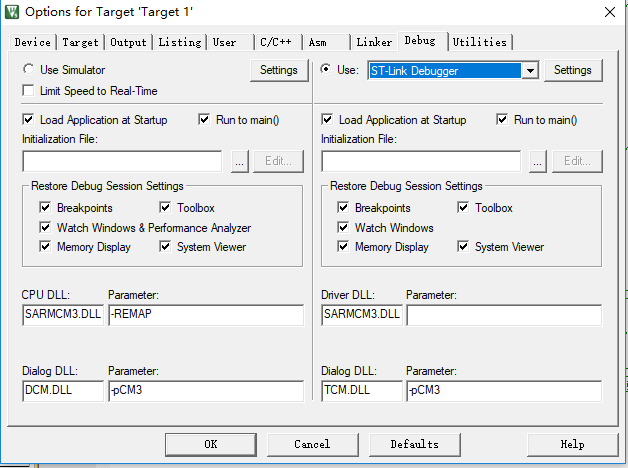

# KEIL -重装程序时附图文- 

## 安装步骤：

1. 安装路径不能中文，必须英文
2. 安装目录不能和51的KEIL冲突
3. KEIL5的安装比KEIL4多了一个步骤，必须先添加`MCU`库，不然没法使用
4. 安装完KEIL5之后，需要进行破解
   1. 使用管理员权限打开KEIL5，在File选项 -> Licence Managemet 中获取`Computer ID`
   2. 在网上寻找注册破解机，需要关闭杀毒软件(误报有毒)，使用管理员权限打开，复制之前的`Computer ID`,得到破解码
   3. 在将破解码复制到KEIL5的LIC中，显示2020字样，则表示成功
5. 安装STM32芯片包，`F1 代表M3，F4 代表M4，F7 代表M7`

[MCU库下载地址](http://www.keil.com/dd2/pack/ )

[KEIL5安装包的获取](https://www.keil.com/download/product/ )

## JLink的配置步骤

## JLink的安装

1. 安装JLink驱动
2. 检查JLink是否安装成功，在我的电脑的属性页中的设备管理器中查看

## JLink的配置

1. 点击魔术棒

   

2. 配置JLink型号,在Debug界面，选择所使用的JLink型号

   

3. 点击Settings,在Debug界面配置下载模式：

   

4. 在Flash Download界面配置,配置Reset and Run 和 编程算法

   

