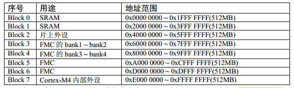

# 初识STM32

## 什么是STM32

- STM32从字面上来理解， ST 是意法半导体， M 是 Microelectronics 的缩写， 32 表示 32 位 ，可以直观地认为**int占4个字节**
- 合起来理解， STM32 就是指 ST 公司开发的 32 位微控制器
- 将STM32放正，左下角为1脚，逆时针旋转自增

## STM32 的IO原理图分配

- 电源引脚
- 启动引脚(从flash启动[一般使用]，从内部SRAM启动，从外部RAM启动)
- 晶振引脚
- 复位IO引脚(低电平复位)
- 下载IO引脚
- 通用IO引脚（一般的引脚输入输出为3.3V，带FT的为容忍5V）

## 寄存器

- 存储器映射：

  - 器件本身并没有地址，厂商或者用户自行分配，称之为存储器映射

- 存储器重映射：

  - 在存储器映射的基础上，再次分配内存地址

- 寄存器映射:

  - STM32系列的单片机的机器字长为32位
  - 在存储器映射的Block2 这块区域设计的是片上外设，他们以4个字节为一个功能单元
  - 给这4个字节(地址已经分配好了)功能单元起别名的过程叫做寄存器映射

- 存储器映射的分区;

  - STM32 有4G个地址空间
  - 4G空间分为了8个分区，每一个Block块大小为512MB

  

  - Block0 设计为内部Flash，主要是程序存储
  - Block1设计为内部RAM
  - Block2设计为片上外设

  