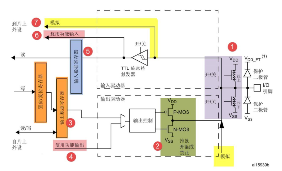
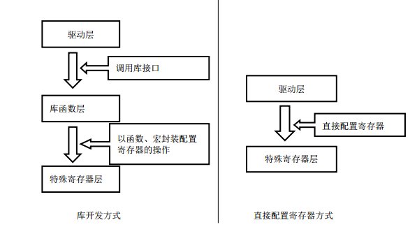

# 寄存器点亮LED灯

## GPIO简介

- GPIO口最基本的功能是输入输出

- GPIO端口的基本结构

- GPIO口的8种配置模式:（4种输入，2种输出，2种复用）

  - 输入上拉
  - 输入下拉
  - 输入浮空
  - 模拟输入
  - 开漏输出
  - 推挽输出
  - 推挽复用
  - 开漏复用

- IO端口位的基本结构：

  

  - 保护二极管及其上拉和下拉电阻
    - 二极防止引脚过低或者过高的电压输入
    - 上拉和下拉电阻可以配置引脚的默认状态的电压
  - 输出控制：P-MOS和N-MOS
    - 具有推挽输出和开漏输出
    - 推挽输出的负载能力和开关速度比普通方式有很大的提高
    - 开漏输出：
      - 控制输出0时，输出低电平
      - 控制输出1时，为高阻态，正常使用必须接上拉电阻
      - 开漏输出具有线与特性，很多的开漏引脚连接在一块，只有当所有的引脚输出高阻态时，才由上拉电阻提供高电压
      - 通常使用场合：
        - 用于需要线与功能的总线电路
        - 还用在电平不匹配的场合：如输出5V高电平，可在外部接一个上拉电阻，上拉电源为5V，且模式为开漏模式，控制输出为0，引脚为高阻态模式
  - 输出数据寄存器：`GPIOx_ODR`
  - 复用功能输出：第二功能输出
  - 输入数据寄存器：`GPIOx_IDR`
  - 复用功能输入：第二功能输入
  - 模拟输入输出：ADC相关，此时信号无需经过施密特触发器（只有1/0状态）
    - 当GPIO用于模拟功能时，上下拉电阻不起作用

## GPIO寄存器点亮LED灯

```c
/**
 *
 * 使用寄存器点亮LED灯PA8,另一端接VCC3.3V
 *
 **/
//片上外设基地址
#define PERIPH_BASE			((unsigned int)0x40000000)  //unsigned int,32位，int也为32位

#define AHBPERIPH_BASE        	(PERIPH_BASE + 0x20000) 
#define RCC_BASE              	(AHBPERIPH_BASE + 0x1000)
#define RCC_APB2ENR             *(unsigned int *)(RCC_BASE + 0x0018)

//GPIOA的相关寄存器配置
#define APB2PERIPH_BASE		(PERIPH_BASE   + 0x10000 )
#define GPIOA_BASE			(APB2PERIPH_BASE     + 0x0800  )
#define GPIOA_CRL			*(unsigned int *)(GPIOA_BASE  + 0x0000  )
#define GPIOA_CRH			*(unsigned int *)(GPIOA_BASE  + 0x0004  )
#define GPIOA_IDR			*(unsigned int *)(GPIOA_BASE  + 0x0008  )
#define GPIOA_ODR			*(unsigned int *)(GPIOA_BASE  + 0x000C  )
#define GPIOA_BSRR			*(unsigned int *)(GPIOA_BASE  + 0x0010  )
#define GPIOA_BRR			*(unsigned int *)(GPIOA_BASE  + 0x0014  )
#define GPIOA_LCKR			*(unsigned int *)(GPIOA_BASE  + 0x0018  )

int main(void)
{
	//GPIOA的开启时钟
	RCC_APB2ENR &= ~(1 << 2); 
	RCC_APB2ENR |= (1 << 2);  
	
	//GPIOA配置为输出模式，最大速度为50Mhz
	//清空
	GPIOA_CRH   &= ~(3 << (2 * 0));   
	//赋值
	GPIOA_CRH   |= (3 << (2 * 0));   
	
	//GPIOA的模式选择：0x00 为通用推挽输出
	//清空
	GPIOA_CRH   &= ~(3 << (2 * 1)); 
	//赋值
	GPIOA_CRH   |= (00 << (2 * 1));  
	
	//设置PGIOA的输出电平
	
	
	//清空
	GPIOA_ODR &= ~(0 << 8);
	while(1)
	{
		
		GPIOA_ODR |= (1 << 8);
	}
	return 0;
}
```

## 库开发和寄存器开发



## 库函数的开发雏形

> 优点：
>
> ​	开发速度快
>
> ​	可读性强
>
> ​	维护简单

```c
/**
 *
 * 使用库函数雏形点亮LED灯PA8,另一端接VCC3.3V
 *
 **/

//片上外设基地址
#define PERIPH_BASE			((unsigned int)0x40000000)  //unsigned int,32位，int也为32位


#define AHBPERIPH_BASE        	(PERIPH_BASE + 0x20000) 
#define RCC_BASE              	(AHBPERIPH_BASE + 0x1000)
#define RCC_APB2ENR             *(unsigned int *)(RCC_BASE + 0x0018)


//GPIOA的相关寄存器配置
#define APB2PERIPH_BASE		(PERIPH_BASE   + 0x10000 )
#define GPIOA_BASE			(APB2PERIPH_BASE     + 0x0800  )

typedef struct
{
  volatile unsigned int CRL;
  volatile unsigned int CRH;
  volatile unsigned int IDR;
  volatile unsigned int ODR;
  volatile unsigned int BSRR;
  volatile unsigned int BRR;
  volatile unsigned int LCKR;
} GPIO_TypeDef;
//这里使用了结构体的字节对齐
//使得结构体地址等于GPIOA外设的基地址
//结构体的成员等于寄存器地址
//使得寄存器开发过程中的基地址+偏移地址可以使用结构体基地址+结构体成员地址来访问
//我们只需要知道外设的基地址，就可以操作所有的相关的外设寄存器
#define GPIOA 		((GPIO_TypeDef *)GPIOA_BASE)


int main(void)
{
	
	//GPIOA的开启时钟
	RCC_APB2ENR &= ~(1 << 2); 
	RCC_APB2ENR |= (1 << 2);  
	
	//GPIOA配置为输出模式，最大速度为50Mhz
	//清空
	GPIOA->CRH   &= ~(3 << (2 * 0));   
	//赋值
	GPIOA->CRH   |= (3 << (2 * 0));   
	
	//GPIOA的模式选择：0x00 为通用推挽输出
	//清空
	GPIOA->CRH   &= ~(3 << (2 * 1)); 
	//赋值
	GPIOA->CRH   |= (00 << (2 * 1));  
	
	//设置PGIOA的输出电平
	
	
	//清空
	GPIOA->ODR &= ~(0 << 8);
	while(1)
	{
		
		GPIOA->ODR |= (0 << 8);
	}
	return 0;
}
```

## 库函数的进一步雏形

```c
/**
 *
 * 使用寄存器点亮LED灯PA8,另一端接VCC3.3V
 *
 **/


//片上外设基地址
#define PERIPH_BASE			((unsigned int)0x40000000)  //unsigned int,32位，int也为32位


#define AHBPERIPH_BASE        	(PERIPH_BASE + 0x20000) 
#define RCC_BASE              	(AHBPERIPH_BASE + 0x1000)
#define RCC_APB2ENR             *(unsigned int *)(RCC_BASE + 0x0018)


//GPIOA的相关寄存器配置
#define APB2PERIPH_BASE		(PERIPH_BASE   + 0x10000 )
#define GPIOA_BASE			(APB2PERIPH_BASE     + 0x0800  )

typedef struct
{
  volatile unsigned int CRL;
  volatile unsigned int CRH;
  volatile unsigned int IDR;
  volatile unsigned int ODR;
  volatile unsigned int BSRR;
  volatile unsigned int BRR;
  volatile unsigned int LCKR;
} GPIO_TypeDef;

#define GPIOA 		((GPIO_TypeDef *)GPIOA_BASE)

#define GPIOA_Pin_8	(unsigned short)0x0100
	
typedef struct {
	unsigned int GPIO_Mode;
	unsigned int GPIO_Speed;
	
}GPIO_InitTypeDef;


void GPIO_ResetBit(GPIO_TypeDef* GPIOx, unsigned short GPIO_Pin);
void GPIO_SetBit(GPIO_TypeDef* GPIOx, unsigned short GPIO_Pin);


int main(void)
{
	GPIO_InitTypeDef GPIO_InitTypeStructure;
	
	//GPIOA的开启时钟
	RCC_APB2ENR &= ~(1 << 2); 
	RCC_APB2ENR |= (1 << 2);  

	//GPIOA配置为输出模式，最大速度为50Mhz
	//清空
	GPIOA->CRH   &= ~(3 << (2 * 0));   
	//赋值
	GPIOA->CRH   |= (3 << (2 * 0));   
	
	//GPIOA的模式选择：0x00 为通用推挽输出
	//清空
	GPIOA->CRH   &= ~(3 << (2 * 1)); 
	//赋值
	GPIOA->CRH   |= (00 << (2 * 1));  
	
	//设置PGIOA的输出电平
	
	while(1)
	{
		
		GPIO_ResetBit(GPIOA,GPIOA_Pin_8);
	}
	return 0;
}

void GPIO_ResetBit(GPIO_TypeDef* GPIOx, unsigned short GPIO_Pin)
{
    //对参数进行assert
	GPIOx->BRR = GPIO_Pin;
}	

void GPIO_SetBit(GPIO_TypeDef* GPIOx, unsigned short GPIO_Pin)
{
    //对参数进行assert
	GPIOx->BSRR = GPIO_Pin;
}	

```

- 这一部分并没有完全写完，每一个函数都应该有参数的判定
- 对于GPIO外设的初始化，应该使用结构体(便于配置) + 枚举(限制参数的个数)来进行简化。

## GPIO初始化函数源码分析

```C
//IS_GPIO_PIN(GPIO_InitStruct->GPIO_Pin)的宏定义
#define IS_GPIO_PIN(PIN)  ((((PIN) & (uint16_t)0x00) == 0x00) && ((PIN) != (uint16_t)0x00))
//这个宏定义要和上面的GPIO_Pin的引脚宏定义结合起来理解
//这个宏定义比较简便
```


```C
void GPIO_Init(GPIO_TypeDef* GPIOx, GPIO_InitTypeDef* GPIO_InitStruct)
{
  uint32_t currentmode = 0x00, currentpin = 0x00, pinpos = 0x00, pos = 0x00;
  uint32_t tmpreg = 0x00, pinmask = 0x00;
  /*参数检查，这个比较好理解，默认未开启 */
  assert_param(IS_GPIO_ALL_PERIPH(GPIOx));//断言是否是GPIOA~GPIOX
  assert_param(IS_GPIO_MODE(GPIO_InitStruct->GPIO_Mode));//断言是否是枚举的成员
  assert_param(IS_GPIO_PIN(GPIO_InitStruct->GPIO_Pin)); //断言是否是引脚
  
/*---------------------------- 配置GPIO模式 -----------------------*/
  /*取第0~3位*/
   currentmode = ((uint32_t)GPIO_InitStruct->GPIO_Mode) & ((uint32_t)0x0F);
  /*bit4位为输入输出为，0位输入，1位输出，输出模式需要增加输出速度*/
  if ((((uint32_t)GPIO_InitStruct->GPIO_Mode) & ((uint32_t)0x10)) != 0x00)
  { 
    /* Check the parameters */
    assert_param(IS_GPIO_SPEED(GPIO_InitStruct->GPIO_Speed));
    /* Output mode */
    currentmode |= (uint32_t)GPIO_InitStruct->GPIO_Speed;
  }
/*---------------------------- 配置GPIO的低8位 ------------------------*/
  /* 获取相应的引脚，再将其膨胀为4位，在进行操作 */
  if (((uint32_t)GPIO_InitStruct->GPIO_Pin & ((uint32_t)0x00FF)) != 0x00)
  {
      /*CRL备份数据*/
    tmpreg = GPIOx->CRL;
    //一共8引脚，循环检测8次
    for (pinpos = 0x00; pinpos < 0x08; pinpos++)
    {
      //匹配时的mask
      pos = ((uint32_t)0x01) << pinpos;
      /* 得到当前的pin */
      currentpin = (GPIO_InitStruct->GPIO_Pin) & pos;
      /*只有当currentpin == pos 时，pinpos才是真正的引脚*/
      if (currentpin == pos)
      {
        /*引脚膨胀为4位，其实为乘4操作*/
        pos = pinpos << 2;
        /* 清空相应位的4位寄存器 */
        pinmask = ((uint32_t)0x0F) << pos;
        tmpreg &= ~pinmask;
        /*赋值寄存器值到tmpreg中 */
        tmpreg |= (currentmode << pos);
        /* 使用BSRR和BRR配置上拉和下拉模式 */
        if (GPIO_InitStruct->GPIO_Mode == GPIO_Mode_IPD)
        {
          GPIOx->BRR = (((uint32_t)0x01) << pinpos);
        }
        else
        {
          if (GPIO_InitStruct->GPIO_Mode == GPIO_Mode_IPU)
          {
            GPIOx->BSRR = (((uint32_t)0x01) << pinpos);
          }
        }
      }
    }
      /*CRL的赋值操作*/
    GPIOx->CRL = tmpreg;
  }
/*---------------------------- GPIO CRH Configuration ------------------------*/
  /* Configure the eight high port pins */
  if (GPIO_InitStruct->GPIO_Pin > 0x00FF)
  {
    tmpreg = GPIOx->CRH;
    for (pinpos = 0x00; pinpos < 0x08; pinpos++)
    {
      pos = (((uint32_t)0x01) << (pinpos + 0x08));
      /* Get the port pins position */
      currentpin = ((GPIO_InitStruct->GPIO_Pin) & pos);
      if (currentpin == pos)
      {
        pos = pinpos << 2;
        /* Clear the corresponding high control register bits */
        pinmask = ((uint32_t)0x0F) << pos;
        tmpreg &= ~pinmask;
        /* Write the mode configuration in the corresponding bits */
        tmpreg |= (currentmode << pos);
        /* Reset the corresponding ODR bit */
        if (GPIO_InitStruct->GPIO_Mode == GPIO_Mode_IPD)
        {
          GPIOx->BRR = (((uint32_t)0x01) << (pinpos + 0x08));
        }
        /* Set the corresponding ODR bit */
        if (GPIO_InitStruct->GPIO_Mode == GPIO_Mode_IPU)
        {
          GPIOx->BSRR = (((uint32_t)0x01) << (pinpos + 0x08));
        }
      }
    }
    GPIOx->CRH = tmpreg;
  }
}
```

# 库函数完整

```C
/**
 *
 * 使用寄存器点亮LED灯PA8,另一端接VCC3.3V
 *
 **/

//片上外设基地址
#define PERIPH_BASE				((unsigned int)0x40000000)  //unsigned int,32位，int也为32位

//时钟基地址
#define AHBPERIPH_BASE        	(PERIPH_BASE + 0x20000) 
#define RCC_BASE              	(AHBPERIPH_BASE + 0x1000)
#define RCC_APB2ENR             *(unsigned int *)(RCC_BASE + 0x0018)


//GPIOA的相关寄存器配置
#define APB2PERIPH_BASE			(PERIPH_BASE + 0x10000 )
#define GPIOA_BASE				(APB2PERIPH_BASE + 0x0800  )

typedef struct
{
  volatile unsigned int CRL;
  volatile unsigned int CRH;
  volatile unsigned int IDR;
  volatile unsigned int ODR;
  volatile unsigned int BSRR;
  volatile unsigned int BRR;
  volatile unsigned int LCKR;
} GPIO_TypeDef;

#define GPIOA 		((GPIO_TypeDef *)GPIOA_BASE)

#define assert_param(expr) ((expr) ? (void)0 : assert_failed((unsigned char  *)__FILE__, __LINE__))

#define _IS_IS_GPIOx(GPIOx)  ((GPIOx == GPIOA) || \
							  (GPIOx == GPIOB) || \
							  (GPIOx == GPIOC))

//GPIO引脚配置
#define GPIO_Pin_0                 ((unsigned short int)0x0001)  /*!< Pin 0 selected */
#define GPIO_Pin_1                 ((unsigned short int)0x0002)  /*!< Pin 1 selected */
#define GPIO_Pin_2                 ((unsigned short int)0x0004)  /*!< Pin 2 selected */
#define GPIO_Pin_3                 ((unsigned short int)0x0008)  /*!< Pin 3 selected */
#define GPIO_Pin_4                 ((unsigned short int)0x0010)  /*!< Pin 4 selected */
#define GPIO_Pin_5                 ((unsigned short int)0x0020)  /*!< Pin 5 selected */
#define GPIO_Pin_6                 ((unsigned short int)0x0040)  /*!< Pin 6 selected */
#define GPIO_Pin_7                 ((unsigned short int)0x0080)  /*!< Pin 7 selected */
#define GPIO_Pin_8                 ((unsigned short int)0x0100)  /*!< Pin 8 selected */
#define GPIO_Pin_9                 ((unsigned short int)0x0200)  /*!< Pin 9 selected */
#define GPIO_Pin_10                ((unsigned short int)0x0400)  /*!< Pin 10 selected */
#define GPIO_Pin_11                ((unsigned short int)0x0800)  /*!< Pin 11 selected */
#define GPIO_Pin_12                ((unsigned short int)0x1000)  /*!< Pin 12 selected */
#define GPIO_Pin_13                ((unsigned short int)0x2000)  /*!< Pin 13 selected */
#define GPIO_Pin_14                ((unsigned short int)0x4000)  /*!< Pin 14 selected */
#define GPIO_Pin_15                ((unsigned short int)0x8000)  /*!< Pin 15 selected */
#define GPIO_Pin_All               ((unsigned short int)0xFFFF)  /*!< All pins selected */

#define _IS_GPIO_PIN(pin)			((((unsigned int)pin &0x0000) == 0) && (unsigned int)pin != 0x0000)

//限制输入模式
typedef enum
{
	GPIO_Mode_AIN = 0x0,
	GPIO_Mode_IN_FLOATING = 0x04, 
	GPIO_Mode_IPD = 0x28,         
	GPIO_Mode_IPU = 0x48,        
	GPIO_Mode_Out_OD = 0x14,      
	GPIO_Mode_Out_PP = 0x10,
	GPIO_Mode_AF_OD = 0x1C,
	GPIO_Mode_AF_PP = 0x18
	
}GPIOMode_TypeDef;

//限制输出速度
typedef enum
{
	GPIO_Speed_10MHz = 1,
	GPIO_Speed_2MHz, 
	GPIO_Speed_50MHz
}GPIOSpeed_TypeDef;

//GPIO初始化结构体
typedef struct
{
	unsigned short GPIO_Pin;
	GPIOSpeed_TypeDef GPIO_Speed;
	 GPIOMode_TypeDef GPIO_Mode; 
}GPIO_InitTypeDef;

//unsigned short 
/*
 0000 0000
*/


void GPIO_ResetBit(GPIO_TypeDef* GPIOx, unsigned short GPIO_Pin);
void GPIO_SetBit(GPIO_TypeDef* GPIOx, unsigned short GPIO_Pin);
void GPIOA_Init(GPIO_TypeDef* GPIOx, GPIO_InitTypeDef* GPIO_InitStruct);


int main(void)
{
	GPIO_InitTypeDef GPIO_InitTypeStructure;
	
	//GPIOA的开启时钟
	RCC_APB2ENR &= ~(1 << 2); 
	RCC_APB2ENR |= (1 << 2);  
	
	GPIO_InitTypeStructure.GPIO_Pin = GPIO_Pin_8;
	GPIO_InitTypeStructure.GPIO_Mode = GPIO_Mode_Out_PP;
	GPIO_InitTypeStructure.GPIO_Speed = GPIO_Speed_50MHz;
	GPIOA_Init(GPIOA,&GPIO_InitTypeStructure);
	
	while(1)
	{
		
		GPIO_ResetBit(GPIOA,GPIO_Pin_8);
	}
	return 0;
}

void GPIO_ResetBit(GPIO_TypeDef* GPIOx, unsigned short GPIO_Pin)
{
	//assert_param(_IS_GPIO_PIN(GPIO_Pin));
	GPIOx->BRR = GPIO_Pin;
}	

void GPIO_SetBit(GPIO_TypeDef* GPIOx, unsigned short GPIO_Pin)
{
	//assert_param(_IS_GPIO_PIN(GPIO_Pin));
	GPIOx->BSRR = GPIO_Pin;
}	

void GPIOA_Init(GPIO_TypeDef* GPIOx, GPIO_InitTypeDef* GPIO_InitStruct)
{
  unsigned int currentmode = 0x00, currentpin = 0x00, pinpos = 0x00, pos = 0x00;
  unsigned int tmpreg = 0x00, pinmask = 0x00;
  /* 函数的形参检测，assert_param()只是提供了出错时的函数，但没有实现各个部分参数判断，最重要的是将函数形参的正误用1或者0来表示 */
  /*使用宏定义和逻辑或操作实现参数的正误判断*/
  //assert_param(IS_GPIO_ALL_PERIPH(GPIOx));
  /*对于配置过程中有限参数可以使用枚举作一下限制*/
  //assert_param(IS_GPIO_MODE(GPIO_InitStruct->GPIO_Mode));
  /*这个判断思路值的借鉴，使用短路与操作*/
 // assert_param(IS_GPIO_PIN(GPIO_InitStruct->GPIO_Pin));  
  
/*---------------------------- GPIO Mode Configuration -----------------------*/
	//得到0~3位，配置CRL/CRH的CNF 和NODE 这4位，主要配置输入/出模式
  currentmode = ((unsigned int)GPIO_InitStruct->GPIO_Mode) & ((unsigned int)0x0F);
	//得到第4位，0表示输入，1表示输出，如果是输出，则需要加上输出速度设置
  if ((((unsigned int)GPIO_InitStruct->GPIO_Mode) & ((unsigned int)0x10)) != 0x00)
  { 
    /* Check the parameters */
   // assert_param(IS_GPIO_SPEED(GPIO_InitStruct->GPIO_Speed));
    /* Output mode */
    currentmode |= (unsigned int)GPIO_InitStruct->GPIO_Speed;
  }
  
  
/*---------------------------- GPIO CRL Configuration ------------------------*/
  /* 配置低8脚，使用mask得到低8位 */
  if (((unsigned int)GPIO_InitStruct->GPIO_Pin & ((unsigned int)0x00FF)) != 0x00)
  {
	 //tmpreg 记录当前的CRL的状态
    tmpreg = GPIOx->CRL;
	
	//循环从pin0开始，找出对应的pin
    for (pinpos = 0x00; pinpos < 0x08; pinpos++) //运行8次，CRL只管低8位
    {
      pos = ((unsigned int)0x01) << pinpos;       // 1000 000
      /* Get the port pins position */
      currentpin = (GPIO_InitStruct->GPIO_Pin) & pos; //得到当前的pin的16进制值                                                                                                                                                                                                                                                                                                                                                                                              
		
	  //表示找到当前引脚
      if (currentpin == pos)
      {
        pos = pinpos << 2;  //7*4 = 28 ,pinpos才是真正的引脚，左移2位为乘4操作，因为寄存器属于4位控制
        /* 清空相应的位*/
        pinmask = ((unsigned int)0x0F) << pos; 
        tmpreg &= ~pinmask;
		  
        /* 将tepreg赋值 */
        tmpreg |= (currentmode << pos);
        /* Reset the corresponding ODR bit */
		  
		
		//值的借鉴，使用if...else结构，实现两个精确的判断条件
        if (GPIO_InitStruct->GPIO_Mode == GPIO_Mode_IPD)
        {
          GPIOx->BRR = (((unsigned int)0x01) << pinpos);
        }
        else
        {
          /* Set the corresponding ODR bit */
          if (GPIO_InitStruct->GPIO_Mode == GPIO_Mode_IPU)
          {
            GPIOx->BSRR = (((unsigned int)0x01) << pinpos);
          }
        }
		
		
      }
    }
	//写入
    GPIOx->CRL = tmpreg;
  }
  

/*---------------------------- GPIO CRH Configuration ------------------------*/
  /* 配置高8位 */
  if (GPIO_InitStruct->GPIO_Pin > 0x00FF)
  {
    tmpreg = GPIOx->CRH;
    for (pinpos = 0x00; pinpos < 0x08; pinpos++)
    {
      pos = (((unsigned int)0x01) << (pinpos + 0x08));
      /* Get the port pins position */
      currentpin = ((GPIO_InitStruct->GPIO_Pin) & pos);
      if (currentpin == pos)
      {
        pos = pinpos << 2;
        pinmask = ((unsigned int)0x0F) << pos;
        tmpreg &= ~pinmask;
        tmpreg |= (currentmode << pos);
        if (GPIO_InitStruct->GPIO_Mode == GPIO_Mode_IPD)
        {
          GPIOx->BRR = (((unsigned int)0x01) << (pinpos + 0x08));
        }
        if (GPIO_InitStruct->GPIO_Mode == GPIO_Mode_IPU)
        {
          GPIOx->BSRR = (((unsigned int)0x01) << (pinpos + 0x08));
        }
      }
    }
    GPIOx->CRH = tmpreg;
  }
}

```

