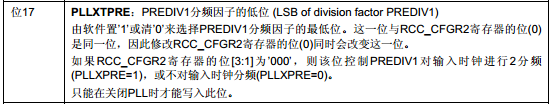

- STM32引脚方面：

  - `OSC_OUT OSC_IN`接4~16MHz,此款开发板使用的是8MHz的晶振
  - `OSC32_IN OSC32_OUT` 接32.768KHz

- 默认状态下，RCC时钟是关闭的

- 本款单片机的时钟：

  - HSE时钟                 8MHz
  - 系统时钟			72MHz
  - AHB总线时钟         72MHz
  - APB1总线时钟        36MHz
  - APB2总线时钟         72MHz
  - PLL时钟	                  72MHz

- 经过分析启动文件得知：

  ```asm
  ;上电执行的第一个程序
  Reset_Handler   PROC
                  EXPORT  Reset_Handler             [WEAK]
                  IMPORT  __main
                  IMPORT  SystemInit 			;在执行时钟初始化
                  LDR     R0, =SystemInit
                  BLX     R0               
                  LDR     R0, =__main			;进入主函数执行
                  BX      R0
                  ENDP
                  
  ```

  - `SystemInit()`函数位于`system_stm32f10x.c`中

- 时钟树：


- 部分分析：

  1.  HSE高速外部时钟信号：`8MHz`

     1. 单片机引脚接口`OSC_OUT OSC_IN` 要求接入`4~16MHz`的晶振，本开发板接入`8MHz`的晶振

     2. `PLLXTPRE`是由寄存器`RCC_CFGR`的位17来控制

        

        

  2. PLL时钟源

     1. `PLL`时钟有两个来源：一个是`HSE`，还有一个是`HSI`的2分频

     2. `PLL`的时钟配置位有`RCC_CFGR`的位16来设置

     3. 一般选用`HSE`作为`PLL`时钟源

        

  3. PLL锁相环的因子`72MHz`

     1. 通过设置`PLL`的倍频因子，可对`PLL`时钟源进行倍频

     2. PLL的倍频因子由`RCC_CFGR的[21-18]`来配置

     3. 官方推荐`72MHz`的稳定运行时钟

        

     4. 系统时钟配置为`72MHz`

        1. 有三个来源：`HSI HSE PLLCLK`

        2. 由`RCC_CFGR`的`[1-0]`来配置

           

     5. AHB总线时钟HCLK`72MHz`

        1. 系统时钟分频经过AHB预分频器得到的时钟叫做APB总线时钟

        2. 由`RCC_CFGR`的`[7-4]`来配置

        3. APB时钟1分频

           

     6. APB2总线时钟`72MHz`

        1. APB2预分频器

        2. 由`RCC_CFGR`的`[13 - 11]`来配置

           

     7. APB1总线时钟 `36MHz`

        由`RCC_CFGR`的`[10 - 8]`来配置

        

# 设置系统时钟初始化函数

```C
#define  RCC_CR_HSEON                        ((uint32_t)0x00010000)//16bit
#define  RCC_CR_HSERDY                       ((uint32_t)0x00020000) //17bit
#define HSE_STARTUP_TIMEOUT   ((uint16_t)0x0500) //out of time
#define  RCC_CFGR_HPRE_DIV1                  ((uint32_t)0x00000000)  //系统时钟不分频
#define  RCC_CFGR_PPRE2_DIV1                 ((uint32_t)0x00000000) //HCLK不分频
static void SetSysClockTo72(void)
{
  __IO uint32_t StartUpCounter = 0, HSEStatus = 0;
  
  /* SYSCLK, HCLK, PCLK2 and PCLK1 configuration ---------------------------*/    
  /* Enable HSE */    
  RCC->CR |= ((uint32_t)RCC_CR_HSEON);
 
  /* Wait till HSE is ready and if Time out is reached exit */
  /*等待HSE时钟准备好，或者超时退出*/
  do
  {
    HSEStatus = RCC->CR & RCC_CR_HSERDY;
    StartUpCounter++;  
  } while((HSEStatus == 0) && (StartUpCounter != HSE_STARTUP_TIMEOUT));

  if ((RCC->CR & RCC_CR_HSERDY) != RESET)
  {
    HSEStatus = (uint32_t)0x01;
  }
  else
  {
    HSEStatus = (uint32_t)0x00;
  }  
/*HSE启动成功，则继续*/
  if (HSEStatus == (uint32_t)0x01)
  {
  /*-----------可以原样照着写-----------*/
    /* Enable Prefetch Buffer */
    FLASH->ACR |= FLASH_ACR_PRFTBE;

    /* Flash 2 wait state */
    FLASH->ACR &= (uint32_t)((uint32_t)~FLASH_ACR_LATENCY);
    FLASH->ACR |= (uint32_t)FLASH_ACR_LATENCY_2;    
/*--------------------------------*/
 
    /* HCLK = SYSCLK，设置分频因子，使用宏定义*/
    /*系统时钟不分频*/
    RCC->CFGR |= (uint32_t)RCC_CFGR_HPRE_DIV1;
      
    /* PCLK2 = HCLK APB2不分频 */
    RCC->CFGR |= (uint32_t)RCC_CFGR_PPRE2_DIV1;
    
    /* PCLK1 = HCLK  APB1 2分频*/
    RCC->CFGR |= (uint32_t)RCC_CFGR_PPRE1_DIV2;

    /*  PLL configuration: PLLCLK = HSE * 9 = 72 MHz  9倍频*/
      /*先清零在赋值*/
    RCC->CFGR &= (uint32_t)((uint32_t)~(RCC_CFGR_PLLSRC | RCC_CFGR_PLLXTPRE |
                                        RCC_CFGR_PLLMULL));
    RCC->CFGR |= (uint32_t)(RCC_CFGR_PLLSRC_HSE | RCC_CFGR_PLLMULL9);

    /* Enable PLL */
    RCC->CR |= RCC_CR_PLLON;

    /* Wait till PLL is ready */
    while((RCC->CR & RCC_CR_PLLRDY) == 0)
    {
    }
    
    /* Select PLL as system clock source */
    /*先清零在赋值*/
    RCC->CFGR &= (uint32_t)((uint32_t)~(RCC_CFGR_SW));
    RCC->CFGR |= (uint32_t)RCC_CFGR_SW_PLL;    

    /* 读取时钟切换状态位，确保PLLCLK被选为系统时钟 */
    while ((RCC->CFGR & (uint32_t)RCC_CFGR_SWS) != (uint32_t)0x08)
    {
    }
  }
  else
  { /* If HSE fails to start-up, the application will have wrong clock 
         configuration. User can add here some code to deal with this error */
         /*HSE启动失败，添加错误代码*/
  }
}
```


