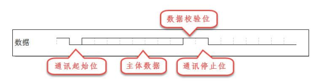
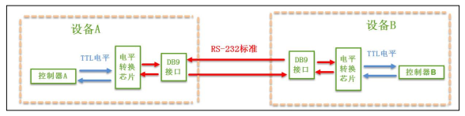
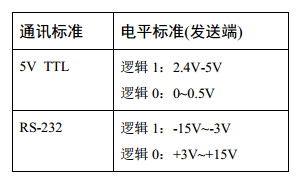
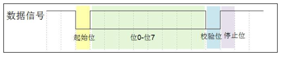
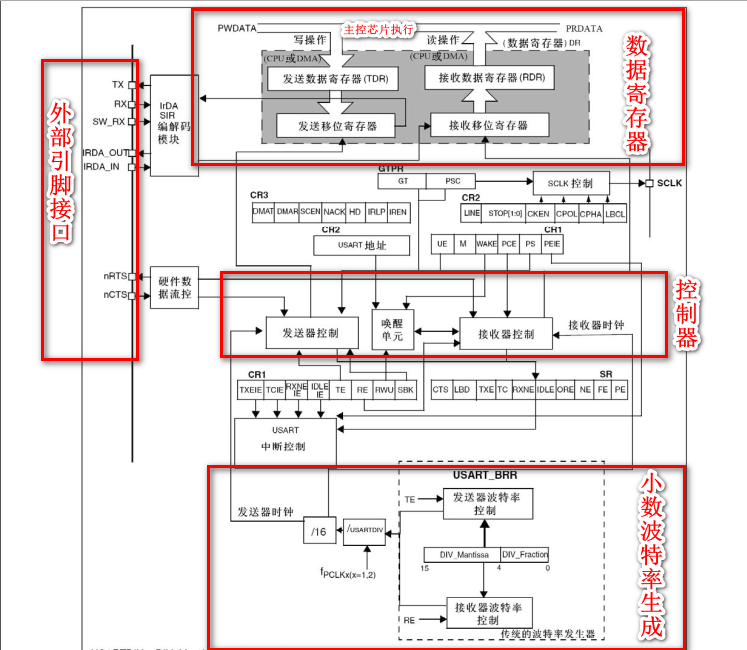
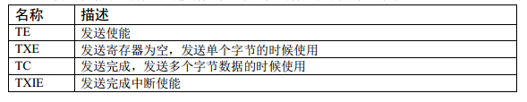
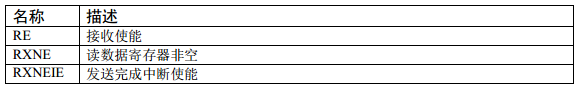
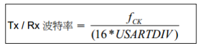

# 基本知识

## 串行和并行

- 概念
- 优缺点
  - 通信距离
  - 抗干扰能力
  - 传输速率
  - 成本

## 单工，半双工，双工

## 同步通信和异步通信

- 同步通信有时钟信号

- 异步通信在数据帧之间穿插一些同步用的信号位

  

- 同步通信速度更快，但是时钟允许误差较小

## 通信速率

- 波特率：每秒传输的二进制的位数
- 比特率：每秒传输的码元数
- 区分：
  - 若1位二进制表示一个码元，则波特率与比特率相同
  - 若2位二进制表示1个码元，则比特率比波特率减半

# 串口

## 串口的物理层

- 主要使用RS232标准（负电平逻辑，抗干扰性强）

  

- TTL电平逻辑和RS232电平逻辑

  

- RS232信号线：GND,TXD,RXD

## 串口协议层

- 数据格式：

  

- 波特率：接受双方一致

- 通讯的起始位和停止位

  - 起始位为逻辑0
  - 停止位可为0.5/1/1.5/2个逻辑1表示，电平宽度可变
    - 默认为1个停止位
    - 2个适用于正常USART模式
    - 0.5个和1.5个适用于智能卡模式

- 有效数据：

  - 5/6/7/8位

- 数据校验：

  - 奇校验/偶校验/无校验/1校验

- 数据字长：

  - 包括有效数据和数据校验位，为8/9位

# STM32的串口物理层



- 外部引脚一般只使用`TX`和`RX`

- 数据寄存器`(USART_DR)`低9位有效，第9位去决议`USART1_CR1`的`M1`位
  - DR包括两个寄存器

- 控制器
  - 使用USART之前需要向UASRT_CR1寄存器的UE位置1使能时钟

  - 数据字长使用USART1_CR1的M位

  - 发送器
    - 发送使能位置1时，启动数据发送功能，使得移位寄存器的数据一位一位的传输到`tx`

    - 数据低位再前，高位在后

    - 一个数据帧包含三个部分：起始位+有效数据位+停止位

    - 总结：

      - 当数据发送使能后，发送器并不直接发送数据帧，而是先发送一个空闲帧（一个数据帧长度的高电平），接下来就可以向DR寄存器中写东西
      - 当写入最后一个数据后，需要等待状态寄存器的TC位为1，表示传输完成
      - 如果状态寄存器的TCIE为1，将产生传输完成中断

    - 重要标志：

      

  - 接收器:

    - RE位置1，使得USART进行接收

    - 先开始搜索起始位（一位的低电平）

    - 搜索到起始位之后，将数据存放到移位寄存器，在通过移位寄存器放到数据寄存器DR中

    - 重要标志：

      

- 小数波特率生成器：

  - 计算公式;

    

  -  $115200 = \frac{7200000}{16 * USARTDIV}$

    - `USARTDIV = 39.065`
    - 可算得：
      - `DIV-Fraction = 0.065*16 = 1 = 0x01`
      - `DIV_Mantissa = 39 = 0x17`

- 校验控制:

  - 奇校验，偶校验，无校验
  - 自动添加以满足奇偶校验的要求

- 中断控制

## 串口初始化结构体

- 成员：

  - 波特率 设置小数波特率生成器
  - 字长     8/9位 ，设置M位
  - 停止位  默认为1个
  - 校验位
  - USART模式设置  发送/接收

- 初始化步骤:

  1. 初始化GPIO口时钟和USART时钟
  2. 配置GPIO口为复用输出模式
  3. 配置NVIC
  4. 配置USART参数
  5. 初始化串口
  6. 开启串口接收中断
  7. 使能串口（最后开启）
  8. 在中断服务函数中实现数据的发送和接收

- 注意:

  - 需要`printf函数重定向`

  - 在C语言中：`printf`的函数原型和`fputc(int ch, FILE *f)`相关，功能是将字符`ch`写入到文件指针指向的文件的写指针位置

  - 需要勾选`Use MicroLIB`

    ```c
    int fputc(int ch, FILE *f){
        while((USART1 ->SR & 0X40) == 0); //循环发送完成，测试TC位是否为1
        USART1->DR = (U8)ch;
        
        return ch;
    }
    ```

  - 发送一个字符:

    ```C
    /*寄存器版*/
    void SendByte(USART_TypeDef * pUSARTx, uint8_t ch){
        pUSARTx->DR = (Data & (uint16_t)0x01FF); //DR寄存器只有低9位有效  
        while(pUSARTx -> SR & 0X80 == 0); //检测TXE位是否为1
    }
    
    /*库函数版*/
    void SendByte(USART_TypeDef * pUSART, uint8_t ch){
    	/*发送一个字节到USART*/
        USART_SendData(pUSARTx,ch);
        /*等待SR寄存器的TXE为变为1，表示单字节数据已经放置到移位寄存器*/
        while (USART_GetFlagStatus(pUSARTx, USART_FLAG_TXE) == RESET);
    }
    ```

  - 发送一个字符串：

    ```C
    /*库函数版*/
    void SendByte(USART_TypeDef * pUSART, char * str){
    	uint16_t k = 0;
    	do{
        	USART_SendData(pUSARTx,*(str+k));
        	k++;
        }while(*(str + k) != '\0');
        /*发送字符串时，需要检测SR寄存器的TC位是否置1*/
        while (USART_GetFlagStatus(pUSARTx, USART_FLAG_TC) == RESET);
    }
    ```

  - 接收函数：

    ```C
    /*接收一个字符*/
    void USART1_IRQHandler(void){
        uint8_t uctemp;
        if(USART_GetFlagStatus(pUSARTx, USART_FLAG_RXNE) != RESET){
            ucTemp = USART_ReceiveData(USART1);
        }
    }     
    ```

- 使用串口指令：

  - 重定向输入函数;

    ```c
    int fgetc(FILE *f){
        while(USART_GetFlagStatus(pUSARTx, USART_FLAG_RXNE) == RESET);
        return (int)USART_ReceiveData(USART1);
    }
    ```

  - 使用`getchar()`来获取串口指令

