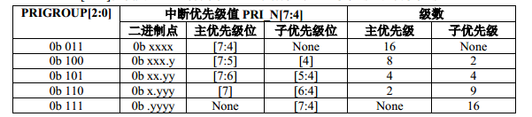
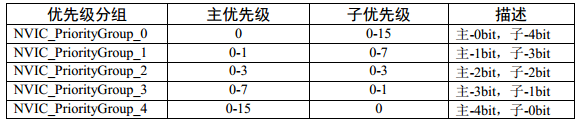

- 明确一个概念：
  - 中断就是异常
  - 异常就是中断
- 系统异常有8个，外部中断有60个
- 除了个别异常被定死，其他异常的优先级可被编程

## NVIC简介

- 嵌套向量中断控制器，为内核的一个外设

- 中断的优先级定义：

  - 数值越小，优先级越高，F103使用高4位，用来表示优先级

  - 主优先级 = 抢占优先级

  - 分为5组

  - 寄存器分布：

    

  - NVIC优先级分组：

    

- 编程要点：

  - 使能中断：这个是有每个部分外设的相应寄存器控制
  - 初始化NVIC结构体
  - 编写中断服务函数